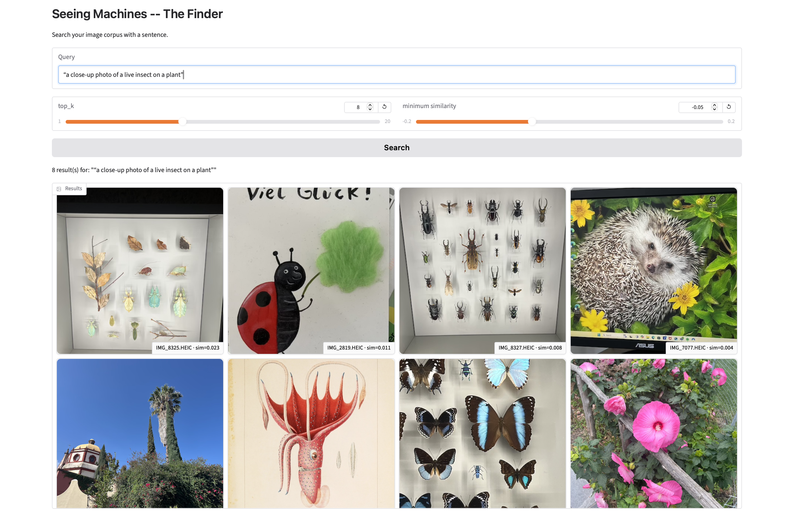
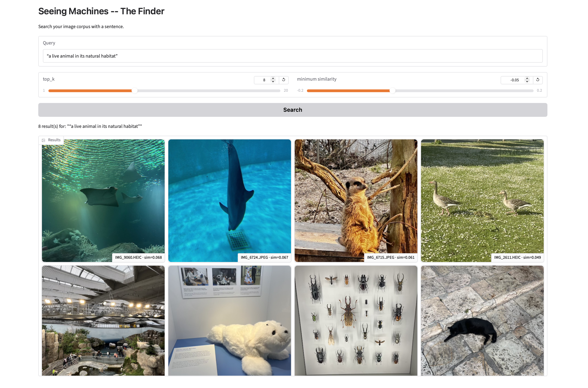
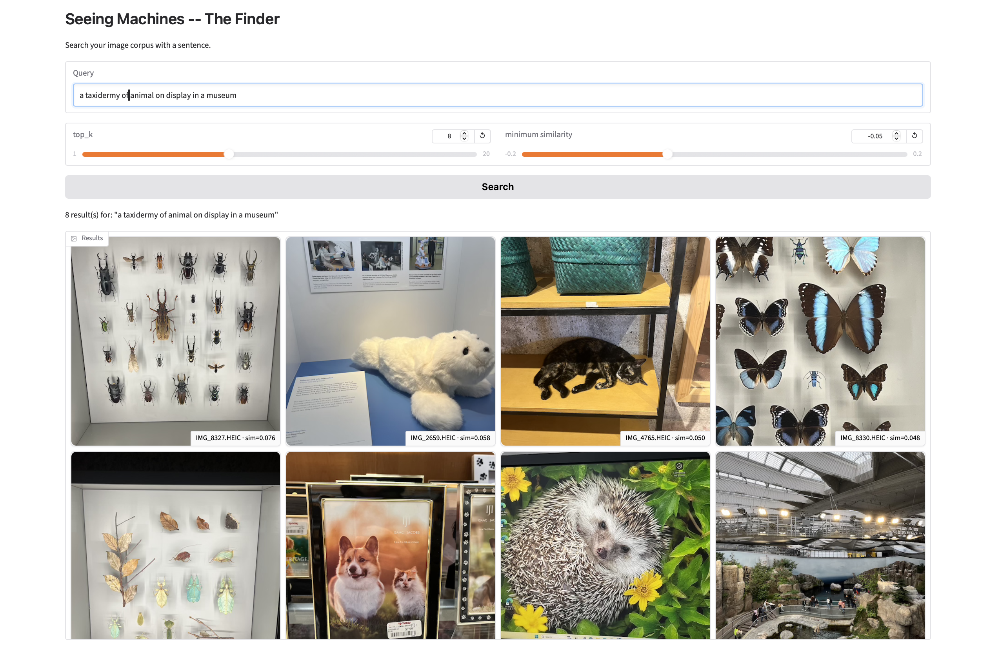
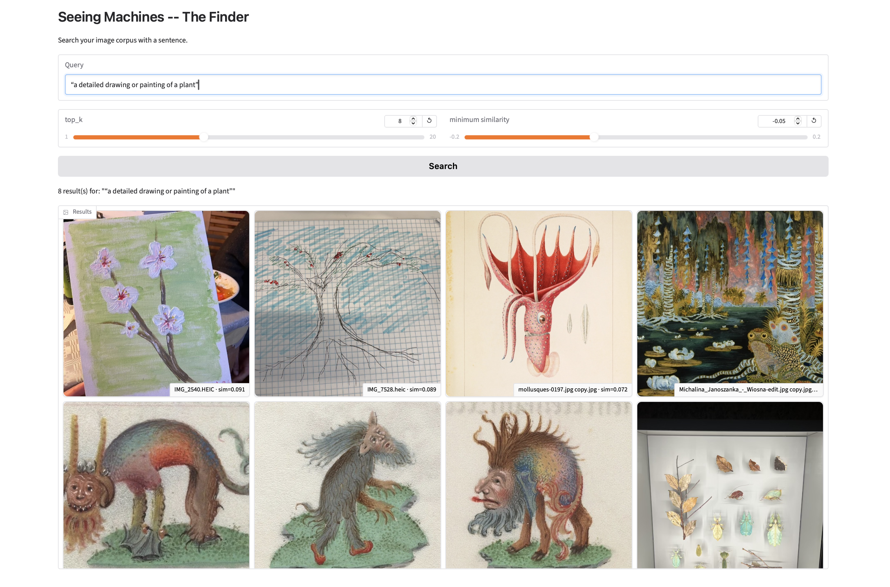
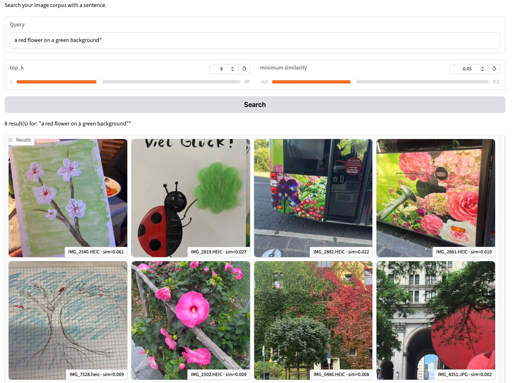
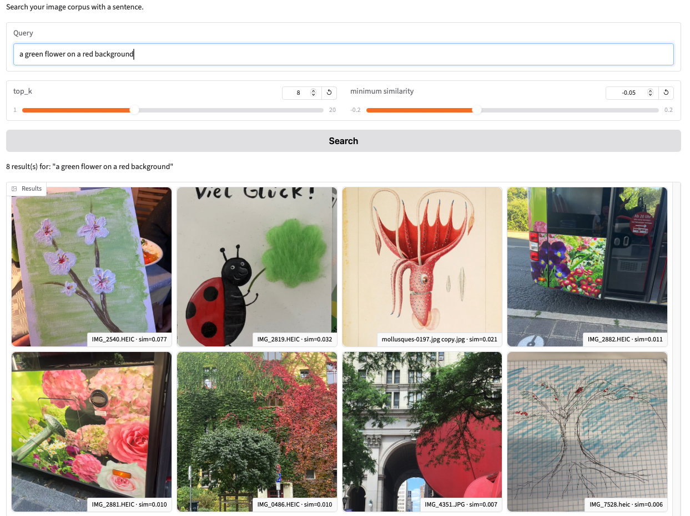
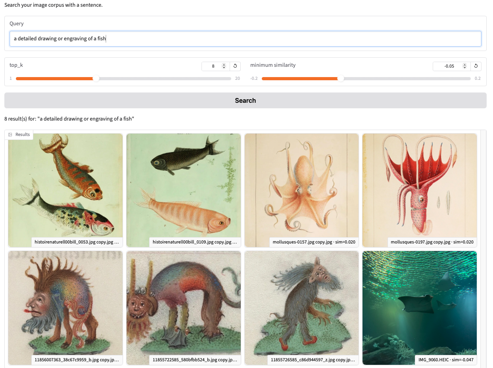

# Appendix

## Appendix A. Retrieval Atlas — Level 1

This appendix documents all ten Level 1 queries used in the retrieval atlas. Each entry shows the query, settings, and a brief explanation grounded in embedding-space reasoning.

### Figure A1. Query: "natural landscape with no live animals"

- `top_k`: 8 · `min_similarity`: -0.05
- **Why:** SigLIP builds a “landscape” cluster composed of parks, ponds, and forests. Animals and creatures inside those scenes do not push images out of this region, so “no live animals” behaves more like a general “landscape” query than a true absence test.

### Figure A2. Query: "bright, colorful illustration of an animal"

- `top_k`: 8 · `min_similarity`: -0.05
- **Why:** Here the model excels. Medieval creatures, fish plates, cephalopod drawings, and fantasy scenes form a coherent “bright illustration” neighbourhood with strong colour, clean outlines, and flat backgrounds.

### Figure A3. Query: "a live animal photographed outdoors, not a drawing"

- `top_k`: 8 · `min_similarity`: -0.05
- **Why:** Even with “not a drawing” in the text, one illustration appears and indoor or screen images still sneak in. The embedding seems dominated by “animal + natural-ish background” and only weakly respects modality and negation.

### Figure A4. Query: "a close-up photo of a live insect on a plant"

- `top_k`: 8 · `min_similarity`: -0.05
- **Why:** The neighbourhood is “insect + plant + close framing”, not “live on plant”. Pinned specimens, cartoon insects, decorative screens, and vintage plates all rank high because they share silhouettes and leaf textures.

### Figure A5. Query: "a live animal in its natural habitat"

- `top_k`: 8 · `min_similarity`: -0.05
- **Why:** The embedding creates one large “animal + environment” cluster. Aquariums, zoo enclosures, biodome scenes, and outdoor habitats all look similar in this space, so “natural habitat” does not separate wild from designed exhibits.

### Figure A6. Query: "a taxidermy animal on display in a museum"

- `top_k`: 8 · `min_similarity`: -0.05
- **Why:** The model clusters “animal + display context”: pinned insects, butterflies in cases, plush toys, and even a sleeping cat on a shelf. It recognises “specimen on display” but does not separate dead specimens from toys or live animals.

### Figure A7. Query: "a detailed drawing or painting of a plant"

- `top_k`: 8 · `min_similarity`: -0.05
- **Why:** SigLIP strongly detects “this is art” (brushstrokes, paper texture), but relaxes the “plant” part, pulling in cephalopods and hybrid creatures. Art style is encoded more strongly than the specific plant category.

### Figure A8. Query: "close-up of a live flower outdoors"

- `top_k`: 8 · `min_similarity`: -0.05
- **Why:** SigLIP focuses on “large pink flower + green background + outdoor lighting”, so printed flowers on buses and vending machines cluster with real flowers. Medium (print versus live plant) is weaker than colour and composition.

### Figure A9. Query: "a detailed drawing or engraving of a fish"

- `top_k`: 8 · `min_similarity`: -0.05
- **Why:** Goldfish and cephalopod plates cluster together as “scientific illustration”, but fish-like colours and shapes in photos can drift into the same neighbourhood, showing how composition and outline sometimes outweigh medium.

### Figure A10. Query pair: "a red flower on a green background" vs. "a green flower on a red background"

- `top_k`: 8 · `min_similarity`: -0.05
- **Why:** Both queries return very similar sets, suggesting that SigLIP treats “red + green + flower” as a bag of features. It does not consistently bind the colour to the correct object, which matches known compositional weaknesses of CLIP-style encoders.

### Table A1. Pairwise cosine similarity for the top 8 matches for Figure A1

| index | IMG_2611.HEIC | IMG_5719.HEIC | IMG_1449.HEIC | IMG_1403.HEIC | IMG_1450.HEIC | IMG_1885.HEIC | IMG_7997.HEIC | IMG_4353.JPG |
|---|---:|---:|---:|---:|---:|---:|---:|---:|
| IMG_2611.HEIC | 1.000 | 0.606 | 0.707 | 0.716 | 0.733 | 0.695 | 0.556 | 0.579 |
| IMG_5719.HEIC | 0.606 | 1.000 | 0.570 | 0.596 | 0.557 | 0.611 | 0.555 | 0.574 |
| IMG_1449.HEIC | 0.707 | 0.570 | 1.000 | 0.832 | 0.919 | 0.753 | 0.611 | 0.700 |
| IMG_1403.HEIC | 0.716 | 0.596 | 0.832 | 1.000 | 0.866 | 0.741 | 0.661 | 0.687 |
| IMG_1450.HEIC | 0.733 | 0.557 | 0.919 | 0.866 | 1.000 | 0.758 | 0.638 | 0.713 |
| IMG_1885.HEIC | 0.695 | 0.611 | 0.753 | 0.741 | 0.758 | 1.000 | 0.622 | 0.628 |
| IMG_7997.HEIC | 0.556 | 0.555 | 0.611 | 0.661 | 0.638 | 0.622 | 1.000 | 0.656 |
| IMG_4353.JPG | 0.579 | 0.574 | 0.700 | 0.687 | 0.713 | 0.628 | 0.656 | 1.000 |

---

## Appendix B. Level 2 Deliverables and Comparison Figures

The figures below correspond to the Level 2 comparison discussion in `index.md`. Where the main documentation refers to motion, lighting, composition, colour, the adversarial pair, and the Level 1-vs-Level 2 comparison queries, it is referring to these numbered screenshots.

### Figure B1. Level 2 comparison screenshot 1

### Figure B2. Level 2 comparison screenshot 2

### Figure B3. Level 2 comparison screenshot 3

### Figure B4. Level 2 comparison screenshot 4

### Figure B5. Level 2 comparison screenshot 5

### Figure B6. Level 2 comparison screenshot 6

### Figure B7. Level 2 comparison screenshot 7

### Figure B8. Level 2 comparison screenshot 8

### Figure B9. Level 2 comparison screenshot 9

### Figure B10. Level 2 comparison screenshot 10

### Figure B11. Level 2 comparison screenshot 11

### Figure B12. Level 2 comparison screenshot 12

### Figure B13. Level 2 comparison screenshot 13

### Figure B14. Level 2 comparison screenshot 14

### Figure B15. Level 2 comparison screenshot 15

