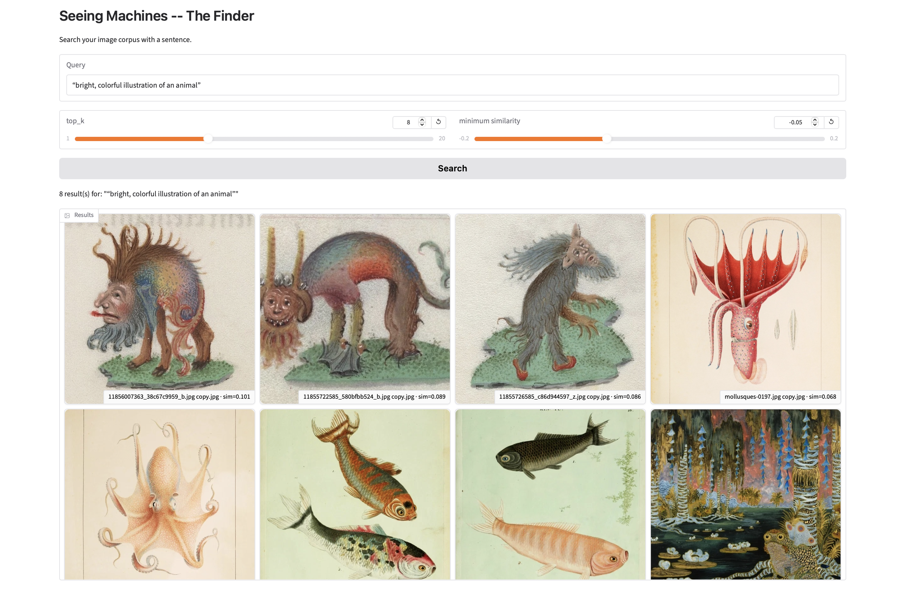

# Seeing Machines – Life vs Stillness

**Min Jeong Park**  
CompSci for Designers 2 · TH Nürnberg

*A small multimodal companion explores a personal archive of fauna and flora and asks: what does it mean, for a machine, to “see life” in pictures?*

---

## Abstract

Human babies begin to sort the visual world into “living” and “non-living” surprisingly early. One recent AI-assisted brain-imaging study suggests that infants can distinguish living beings from inanimate objects within the first few months of life. This project turns that question toward a small vision-language system and a personal archive of about one hundred images of fauna and flora, mixing live subjects with representations such as taxidermy, illustrations, and paintings. The archive is explored through two routes: a Level 1 SigLIP search that embeds images directly, and a Level 2 caption-based route in which a VLM compresses each picture into a structured description before text embedding and retrieval. By comparing where these compressed representations preserve or blur the line between life and stillness—especially in mis-seeing cases where taxidermy or prints are treated as live—the project treats each retrieval path as a different form of “image compression as intelligence” and uses the machine’s mistakes as a way to look again at a familiar archive.

---

## Motivation and Corpus

This project asks how very small systems, human or machine, begin to carve up the visual world. Infant research suggests that babies do not simply receive images passively; they gradually build categories such as “living” and “non-living” long before they can talk about them. [web:211] This project translates that curiosity into a personal setting: how does a compact multimodal model see the same images I have collected, and where does its organisation of the archive diverge from mine?

The corpus consists of 99 images:

- Original photographs of plants and animals taken by the author in different climates and environments.
- Public-domain illustrations and paintings of animals and plants.

All public images in the GitHub repository come from sources that mark the underlying works as public domain or CC0, documented in `LICENSES.txt`. Private, rights-sensitive images remain only in the local Colab corpus.

---

## Approach

 Diagram generated with AI

- **Level 1 – The Finder (SigLIP route)**
  - SigLIP embeds all images once.
  - Text queries are embedded into the same space.
  - Cosine similarity returns the top-
  k images in a Gradio interface.
  - A retrieval atlas logs at least ten queries (for example, "live animal in nature" and "vintage illustration of a plant") with embedding-space reasoning that explains why each query returned those images.

- **Level 2 – The Companion (caption route)**
  - Gemma 3 4B (quantized) generates a structured JSON description for each image.
  - The schema is tested and redesigned iteratively.
  - Captions are flattened to text and embedded with `all-MiniLM-L6-v2`.
  - A FAISS index powers caption-based retrieval.
  - A language model (Gemma in text-only mode) generates grounded answers from the retrieved captions, with the source images displayed alongside the answer.
  - A route toggle in the interface exposes both retrieval paths: the caption route (Level 2) and the SigLIP route (Level 1 baseline), so the same query can be run through either compression on demand.

Throughout, the project treats each route as a different way of compressing the archive: SigLIP compresses images into dense vectors, while Gemma compresses them into compact verbal summaries. The analysis asks which compression better preserves the life-versus-representation distinction and where both fail, which is really the same question raised by the infant-cognition framing, just asked of a machine instead of a three-month-old.

---

## Lv.1 The Finder and Retrieval Atlas

All ten retrieval-atlas queries, screenshots, and short embedding-space explanations are collected in **Appendix A**. The summaries below refer to the numbered query entries in Appendix A1-A10 and to **Table A1** for the similarity matrix.

- Queries such as "bright, colorful illustration of an animal" show that SigLIP has a stable "illustration" cluster in which imaginary creatures, fish, and cephalopods sit together.
- Queries such as "natural landscape with no live animals" reveal that landscapes with geese and fantasy animals remain in the same neighbourhood as empty parks and ponds, suggesting that broad scene statistics ("landscape-ness") outweigh animal presence.
- Close-up probes ("a close-up photo of a live insect on a plant" and "a live animal photographed outdoors, not a drawing") show that the embedding often collapses live subjects, taxidermy, printed images, and drawings into one "small creature + foliage" region.

These entries support the claim that Level 1 compression preserves colour, texture, and composition strongly, but distinguishes only weakly between life and representation.

- **Successful retrievals**
  - **Query A2:** "bright, colorful illustration of an animal"  
      
    Embedding-space reasoning: here the model excels. Imaginary creatures, sea-creature drawings, and fantasy scenes form a coherent "bright illustration" neighbourhood with strong colour, clean outlines, and flat backgrounds.

- **Failure probes and binding tests**
  - **Query A1:** "natural landscape with no live animals"  
      
    Embedding-space reasoning: this query is meant to test absences (no live animals) against the broader "landscape" environment. Geese appear as the top image alongside pure landscapes. SigLIP finds a coherent "landscape" cluster—parks, trees, and ponds—but animals and other creatures inside those scenes do not push the images out of that region. Geese and painted animals stay near pure landscapes if the colours and scene layout match. Negation ("no live animals") does not move the text embedding very far from "natural landscape", so the model still returns visually similar scenes even when they contain animals. This entry is a good example of granularity and negation problems: the model can find landscapes, but cannot prune away subjects that visually belong to the same cluster.

    **UMAP analysis**  
    

    **Observations from the visualisation**
    - **Clustering:** In the UMAP plot, the geese image (`IMG_2611.HEIC`) clusters very closely with landscape images. This suggests that the model is prioritising the "natural landscape" part of the query over the negative constraint "no live animals".
    - **Texture and composition:** SigLIP often focuses on global features. The visual texture of birds in grass can mimic patterns found in purely natural textures, such as rocks or dappled light, causing the model to treat them as strong landscape matches.
    - **Similarity matrix:** As shown in **Table A1 in Appendix A**, several pairwise similarity values between the geese image (`IMG_2611.HEIC`) and other landscape photos are notably high (for example, 0.707 and 0.716). This suggests that, in the model’s internal representational space, these images are nearly indistinguishable from “natural landscapes.”

- **Mixed retrievals**
  - **Query A8:** "close-up of a live flower outdoors"  
      

    **UMAP analysis**  
    

    Embedding-space reasoning: SigLIP is clearly locking onto "big central figure + green background + outdoor lighting", not on whether the flower is actually alive. That is why it retrieves printed flowers on a bus and a picture with a glass jar and nature in the background: visually they share saturated colours, petal-and-stem shapes, and centred composition. Medium (print versus real plant) appears much weaker in the embedding than basic colour and layout.

Moving on to Level 2, the key question becomes: if, in this vision-only embedding, colour and layout outweigh liveness, what changes when a model has to put what it sees into words? Does asking the model to speak make liveness matter more, or does it simply translate the same visual bias into language?

---

## Lv.2 The Companion

### Schema evolution

The schema went through several iterations before settling. The first version treated “is this alive, dead, or a representation” as a single closed-category field with no mechanism for verifying the model’s own judgment, and it had no way to represent purely visual properties such as colour, lighting, or texture. The final version adds fields aimed specifically at making the live-versus-representation judgment more accurate and independently checkable.

| Original field | Final field | What changed and why |
|---|---|---|
| `subject` | `subject` | Unchanged. |
| `subject_status` (7 closed categories: `live_outdoor`, `live_enclosure`, `dead_specimen_or_taxidermy`, `flat_representation_art`, `flat_representation_photo`, `food_or_processed`, `unclear`) | `subject_status` (5 categories, prose form) | `flat_representation_art` and `flat_representation_photo` were collapsed into one `flat representation` category. For this project’s actual question—alive versus represented—the art-versus-photo distinction inside "representation" does not matter. Keeping it split cost the model a discrimination it did not need to make and added another way to be wrong. |
| — | `motion_state` (new) | The original schema could say that an animal was alive, but it had no field for whether it was *moving*—the more specific question the project actually cares about. The notebook states the limitation honestly: a still photo only ever gives indirect motion cues (blur, posture, ground contact), never motion itself. |
| — | `evidence` (new; briefly tried as `status_evidence`, then broadened) | This was the single biggest change. The original `subject_status` was an unverifiable assertion: the model could say "taxidermy" with no way to show *why*. `evidence` forces the model to name the specific visual cue behind both `subject_status` and `motion_state` (for example, a reflection, pose, blur, or brushstroke), which turns a wrong label into an inspectable mis-seeing case. Sometimes the conclusion is right but the cited evidence is fabricated; that is a more precise failure to document than simply "wrong." |
| `notable_objects` | *(dropped)* | This field rarely distinguished images in ways that mattered for retrieval; it mostly duplicated information already implicit in `subject` and `habitat_or_context`. |
| `activity` | *(dropped)* | Superseded by `motion_state`, which asks the more specific and more relevant question for this project. |
| — | `lighting`, `composition`, `surface_texture` (new) | These fields were added after noticing, in the Level 1 versus Level 2 comparison, that purely visual queries about texture, framing, or light quality were unanswerable by the caption route because the schema had no field that could hold that information. `surface_texture` also does double duty for the status question: organic texture, matte paper, and canvas weave can themselves function as status evidence. |
| — | `palette` (added, then dropped) | This field was briefly added to close the same visual-query gap, then removed. Colour does not reliably discriminate alive versus represented, so it was not earning its place in an eight-field budget aimed at that specific question. Dropping it also reopens a genuine caption-route blind spot for comparison with Level 1: a "green, leafy scene" query is a real test of what SigLIP can do that captions structurally cannot. |
| `habitat_or_context` | `habitat_or_context` | Unchanged. |

Net effect: the schema moved from five fields to eight, but the shift was a reallocation rather than simple expansion. Two fields that were not serving the research question were traded for three that were, plus the addition of `evidence` as an accountability mechanism for the field that matters most.

### Final schema

| Field | Description |
|---|---|
| `subject` | The main subject or focal point, in a few words. |
| `subject_status` | One of: living animal/plant photographed outdoors; living animal/plant in an enclosure or tank; dead specimen or taxidermy; flat representation (illustration, painting, or photo of a photo); food or processed biological material; unclear. |
| `motion_state` | Clear or implied motion; active but still; resting or static; not applicable. |
| `evidence` | The specific visual cues that justify both `subject_status` and `motion_state`. |
| `lighting` | Natural or artificial; quality and direction. |
| `composition` | Framing and distance (macro, medium shot, wide establishing). |
| `surface_texture` | Physical surface quality visible in the image (organic texture, matte paper, glossy print, glass reflection, canvas weave). |
| `habitat_or_context` | The environment or setting. |

### Side-by-side comparison on visual cues

The image comparisons discussed below are collected in **Appendix B, Figures B1-B15**.

**Motion**  
"a still, motionless pose that could be mistaken for taxidermy"  

- SigLIP performs better here, while the caption route tends to pull images closer to taxidermy and cannot interpret the query as well as SigLIP. Motion cue alone cannot predict the correct status, and the word "still" biases the model toward false taxidermy judgments even for a sleeping live animal. See **Appendix B, Figure B2**.

**Lighting**  
"a subject under flat, even indoor artificial lighting"  

- Neither route suggests that flat, even lighting is itself a reliable status signal; instead, it skews retrieval toward staged or display-like settings. Subject status varies from inanimate object to living plant. See **Appendix B, Figure B6**.

**Composition**  
"a macro close-up of a live subject in its natural environment"  

- This is a mixed result for both routes. The caption route concentrates more on the living subject in its natural environment than on composition (the close-up), while SigLIP brings in close-ups but not always living subjects. See **Appendix B, Figure B7**.

**Colour**  
"a mostly green, leafy scene"  

- SigLIP retrieves more "greenness" overall. In the caption route, colour begins to correlate with status, which makes the decision to drop `palette` worth reconsidering. See **Appendix B, Figure B9**.

**The adversarial pair**

"a live animal that could be mistaken for taxidermy because it's holding still"  

"a taxidermy mount or illustration that could be mistaken for a living animal"  

- The caption route wins here; SigLIP retrieves illustrations of imaginary beings, which are clearly not enough to establish what is actually "a living animal." See **Appendix B, Figures B10-B11**.

### Level 1 vs. Level 2: when does compression preserve the life/stillness line, and when does it blur it?

Both routes were run on the same five queries to see where the two forms of compression agree and where they diverge. The comparison screenshots are collected in **Appendix B**.

**"Which photos show living animals in motion?"** SigLIP’s top five (similarities from 0.058 down to 0.043) and the caption route’s top five (0.616 down to 0.555) share only two images. More telling than the overlap is what each route is actually keying on: the caption route retrieves on an explicit `motion_state` judgment, so a genuinely blurred or mid-stride animal should surface more reliably. SigLIP has no equivalent channel, so whatever visual correlate of "motion" it is using—blur, dynamic framing, or perhaps outdoor-action-photo aesthetics in general—is much harder to name. See **Appendix B, Figures B12**.

**"Which photos show living animals that are resting or still?"** is the closer pair: three of five images overlap. But two of those same images (`IMG_5788`, `IMG_7077`) also appear in both routes’ top five for the motion query above, which is the more interesting finding than the overlap itself. Neither compression method cleanly separates "moving" from "still" on these particular photos. This is a strong candidate for the mis-seeing dossier—whether it reflects genuine ambiguity in the photograph (an alert, motionless animal can honestly read either way) or a schema weakness is something that still needs to be checked by opening those two images directly, not something either route’s score can settle on its own. See **Appendix B, Figures B13**.

**"Which images are flat representations like paintings, illustrations, or photos of a photo?"** is where the two routes diverge most sharply, and where the argument of this project is clearest. SigLIP’s top five here include two negative similarities, meaning it found nothing it was actually confident about. The caption route’s top five, by contrast, surface several images with filenames that do not match the author’s own photography at all—for example, a numbered stock-photo-style filename and a captioned specimen plate—which are genuine representations, correctly identified as such. This is the schema doing exactly the job it was redesigned to do: "is this a representation?" is a categorical judgment supported by a dedicated field, whereas a general-purpose joint embedding has no comparable channel for that distinction. See **Appendix B, Figures B14**.

**"Which photos look low-light, dim, or artificially lit?"** and **"which photos look blurry, grainy, or low quality?"** both show weak-to-no overlap between routes, and both map directly onto fields (`lighting`, `surface_texture`) that did not exist in the first schema draft. The caption route answers both with clearly differentiated results. Whether that is because the schema is working, or because SigLIP’s raw similarity scores are compressed toward zero for reasons tied more to how the model was trained than to any query-specific weakness, is a caveat worth keeping visible rather than smoothing over. SigLIP’s sigmoid-style training does not spread out raw cosine similarities the way a softmax-contrastive model such as CLIP does, so a flatter score range alone is not proof of a worse embedding, only a different one.

Taken together, caption-mediated retrieval wins most decisively on the query that most directly targets the life-versus-representation distinction: flat representations. That is also the result that feels most trustworthy, because it is exactly the distinction the schema was rebuilt to make explicit. On more purely visual queries such as lighting and texture, the routes diverge in ways that are harder to attribute cleanly to "better" versus "worse" without also accounting for how differently SigLIP and a sigmoid-trained sentence embedder produce their raw numbers.

### Mis-seeing dossier

- **Skewed description (`subject_status`)**
  - `image_name`: `IMG_4351.JPG`  
    `model_said`: "representation: Lack of Biological Signs: There are no indications of any living organisms"  
    `actually_is`: "trees in the picture; cityscape outdoors"  
    `note`: "The large red sculpture and architectural context lead to the wrong category."

- **Hallucination / context confusion**
  - `image_name`: `IMG_5888.HEIC`  
    Old schema result: `subject`: "two felted rabbits indoors" with `subject_status`: "living animal or plant photographed outdoors".  
    Counting error: the felted elephant toy in the background was most likely mistaken for a second rabbit.  
    `model_said`: "two rabbits, three carrots"  
    `actually_is`: "one felted rabbit and one carrot"  
    `note`: "The model most likely counts the felted elephant in the background as the second rabbit and duplicates the carrot count."

  - `image_name`: `IMG_7063.HEIC`  
    `model_said`: "the model says it is a representation, and it also sees a robin and a blue jay"  
    `actually_is`: "real floral bouquet in a vase on a kitchen counter"  
    `note`: "The wilted, drooping look of the flowers leads to a false verdict. The claimed birds were probably inferred from the leaves."

---

## Reflection and Limitations

This project is intentionally small in scale: a single archive, a few compact models, and a narrow research question. Its strengths lie in close reading of one collection rather than broad generalisation. Limitations include:

- Corpus size and a bias toward warm-climate scenes, with less representation material.
- A single embedding model (SigLIP) and a single captioning model (Gemma 3 4B) under specific Colab constraints.
- No explicit training or fine-tuning; all behaviour comes from off-the-shelf checkpoints.
- Both the corpus and the schema went through several rounds of revision over the course of the project.

Reflecting on the results, the project suggests that "seeing life" in images is not yet a simple emergent property of multimodal embeddings, nor is it fully solved by asking a VLM to describe what it sees. Art style, background, and pose often outweigh the biological status of the subject in a joint embedding; a caption schema can do better, but only to the extent that it is deliberately built to ask the right question and to show its reasoning rather than merely assert a conclusion. The comparison above suggests that the caption route’s advantage is real but narrower than first expected: it is strongest exactly where the schema was built to be strong. It is much less clear on purely visual properties where a joint embedding may simply be doing better. The fact that the schema needed multiple revisions to get there is itself part of the finding: a first attempt at "ask the model to say what it sees" defaults to the same unverifiable-label problem the embeddings had, and it took deliberately adding a field that forces evidence, not just a conclusion, to move beyond that. Comparing these machine judgments with infant studies, where life/non-life distinctions appear clearly in brain signals, highlights how much of our own visual intelligence—the kind that does not need a field called `evidence` to justify itself—is still missing from small, general-purpose models.

---

## AI Use Statement

The following AI tools were used in the preparation of this documentation:

- **Perplexity AI** – used to help organise lists and refine explanatory text for the documentation. Outputs were reviewed, edited, and integrated manually; no content was used verbatim without adaptation.
- **Claude AI** – used as a coding and writing assistant for debugging notebook errors, reviewing and revising code structure, iterating on the description schema through discussion, drafting and editing this documentation page, and generating the pipeline diagram. All corpus curation, schema-design decisions, query selection, retrieval and mis-seeing analysis, and final interpretations are the author’s own.
- **GitHub Copilot** ([github.com/features/copilot](https://github.com/features/copilot)) – used within the code editor to assist with Markdown syntax and small code snippets. All suggestions were accepted, modified, or rejected at the author’s discretion.

No AI tool was used to generate the core research content, design decisions, or original analysis. All substantive content, structure, and conclusions in this documentation are the author’s own work.

---

## Sources and References

- O’Doherty, C., Dineen, Á. T., Truzzi, A. et al. *Infants have rich visual categories in ventrotemporal cortex at 2 months of age*. *Nature Neuroscience* 29, 693–702 (2026). https://doi.org/10.1038/s41593-025-02187-8
- Public-domain image sources (botanical plates, mollusc and cephalopod illustrations, postcards, medieval manuscript details), listed in `LICENSES.md`.

---

## More Information

- [Appendix](appendix.md)
- [Licenses](licenses.txt)
